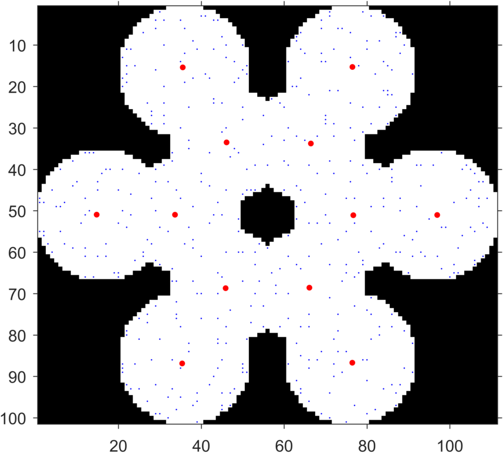

# SALR particle clustering
### A method for locating the centers of partially overlapping convex objects and distributions.
_This project is apart of the manuscript **[J. Kapaldo et al. (submitted)](https://arxiv.org/abs/1804.04071)**._


SALR particle clustering is a simple technique for finding the centers of objects. It can be used to locate the centers of overlapping cell nuclei (see to the right), and it can be used to locate the cluster centers in scatter point data. Further details with examples can be seed at the [project website](https://jkpld.github.io/SALR_Clustering/) and the [manuscript](https://arxiv.org/abs/1804.04071).

<table style="width:100%">
  <tr>
    <td valign="top" width="45%" align="center"></td>
    <td valign="top" width="45.8%" align="center"></td>
  </tr>
</table>

## Installation

1. Download the repository.
2. Open Matlab on your computer, and change the current folder to the downloaded repository.
3. Run `setup.m`. This function will
    * Add the necessary files to your Matlab path.
    * Attempt to compile two C functions that will increase the program speed. If a C compiler is not found on your computer, then the code will still run, but it could be slower.
4. Start by browsing the examples located in the `examples/` folder. These same examples can also be seed on the project website under [examples](https://jkpld.github.io/SALR_Clustering/examples/).


#### Installation Notes
* The GitHub repository could take a few minutes to download as the repository is ~200 MB. The majority of this space comes from the example data included.
* `setup.m` will not permanently add the files to your Matlab path. If you want the files to remain on your Matlab path, the run the command `savepath` in the Matlab command window after running `setup.m`.

## Requirements

* Matlab version R2016b or higher. _This is the first version that allows for implicit expansion, which is a feature heavily used in the code._
* The Image Processing Toolbox.
* The Statistics and Machine Learning Toolbox.
* The Parallel Computing Toolbox - _This toolbox is optional, but if you have it, then you will be able to run computations in parallel._

## Example use

```matlab
% Load test image
BW = imread('snowflake.tif');

% Setup parameters
options = seedPointOptions();
options.Wigner_Seitz_Radius = 4;
options.Potential_Parameters = [-1,2,10];
options.Iterations = 3;
options.Minimum_Cluster_Size = 2;
options.Debug = true;

% Compute seed-points
[seedPoints,Info] = computeObjectSeedPoints(logical(BW),options);

% Overlay onto the image the initial positions of all three iterations
% as small blue dots and the final seed-point locations as large red dots.
figure, imshow(BW), hold on;
plot(Info.r0(:,2),Info.r0(:,1),'.b','MarkerSize',3)
plot(seedPoints(:,2),seedPoints(:,1),'.r','MarkerSize',12)
```

